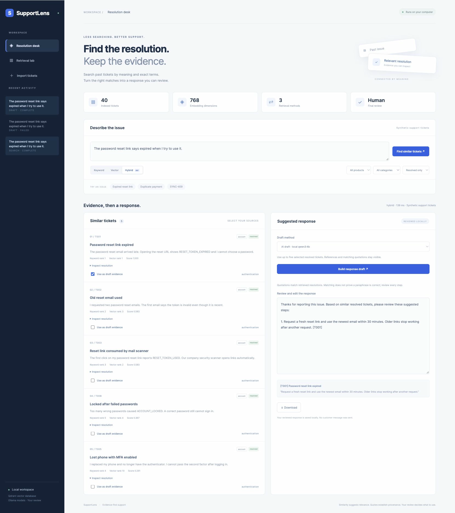
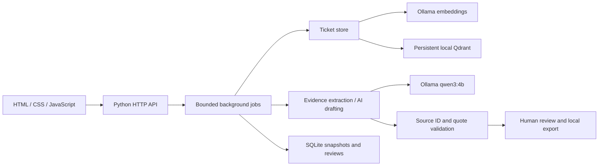

# SupportLens

An AI support workspace that finds useful past resolutions by meaning and exact terms, then builds a response with evidence a human can inspect and approve.

SupportLens uses **Qdrant**, real local **nomic-embed-text** embeddings, and optional **qwen3:4b** response generation through Ollama. The browser frontend and Python backend live in this repository. No paid API key is required.



## What you can do

- Import a CSV or JSON ticket knowledge base, or start with 40 fictional sample tickets.
- Compare keyword, vector, and hybrid search with product, category, and status filters.
- Inspect retrieval ranks, scores, issues, and recorded resolutions.
- Select resolved tickets as evidence for a deterministic extract or a local AI draft.
- Review and edit the draft, approve it locally, and download Markdown with source quotations.
- Run a retrieval evaluation with per-question rankings and labeled relevance.
- Reopen saved searches and reviewed responses from recent activity.

## Run locally

Use Python 3.12 or newer and [Ollama](https://ollama.com/). Start Ollama, then download the models:

```sh
ollama pull nomic-embed-text
ollama pull qwen3:4b
python3 -m venv .venv
source .venv/bin/activate
pip install -e .
python -m supportlens.server
```

On Windows, activate with `.venv\Scripts\activate` instead. Open **http://127.0.0.1:8768**. Click **Index sample tickets**, describe an issue, and search. The generation model is needed only for **AI draft**; evidence extracts require no generative model. Initial indexing requires the embedding model. Once indexed, keyword search can work without Ollama.

The app connects only to Ollama at `127.0.0.1:11434`. Model names are fixed for reproducibility. Download models while online; afterward, indexing, search, and drafting run locally. Available memory and hardware affect model latency.

Use `python -m supportlens.server --port 8768 --data-dir .runtime` to choose a workspace. Run one server per data directory. Saved evidence, reviews, vectors, and datasets stay in that directory and are excluded from Git.

## Walk through the demo

1. Index the sample and search for “The password reset link says expired when I try to use it.”
2. Compare the three retrieval methods. Inspect the first ticket's resolution and select useful sources.
3. Choose **AI draft** or **Evidence extract**, then build a response.
4. Read the source quotes, edit the response if needed, and click **Approve locally**.
5. Download the reviewed response. Approval never sends a message to a customer.
6. Open **Retrieval lab**, run the evaluation, and inspect the returned and relevant ticket IDs.

## Import your own tickets

Upload UTF-8 JSON (an array of objects) or CSV with these exact columns:

```json
[
  {
    "id": "DEMO-001",
    "title": "Password reset link expired",
    "issue": "The reset link reports RESET_TOKEN_EXPIRED.",
    "resolution": "Request a new reset email and use the most recent link promptly.",
    "product": "account",
    "category": "authentication",
    "status": "resolved"
  }
]
```

Imports accept at most 500 tickets and 2 MB. IDs must be unique and use letters, numbers, dots, underscores, or hyphens, starting with a letter or number. Status must be `resolved` or `open`; resolved tickets require a resolution. Title, product, and category are bounded to 200 characters; issue and resolution to 5,000 each. IDs are bounded to 80 characters.

Indexing stages a new collection and activates it only after successful embedding and persistence. Invalid data or model failures preserve the active dataset. Model digests and dimensions are checked: changing embedding weights requires reindexing. The latest two completed datasets are retained internally; dataset switching is not exposed in the UI.

## Architecture



Dense cosine vectors provide semantic retrieval. A preweighted BM25 sparse index provides keyword retrieval. Hybrid search uses Qdrant's native reciprocal rank fusion with filters applied to both retrieval branches. Scores belong to their retrieval method and are not calibrated probabilities. Embedded Qdrant uses exact dense search; this project does not demonstrate distributed deployment or HNSW tuning.

AI drafts contain steps tied to selected, server-owned search evidence. Source IDs must match retrieved resolved tickets, and each quote must occur in the recorded resolution. Invalid references or quotations reject the entire draft. This verifies provenance, not the factual correctness or applicability of every paraphrase. Human edits remain the reviewer's responsibility.

See [architecture](docs/ARCHITECTURE.md), [evaluation](docs/EVALUATION.md), and [security and limits](SECURITY.md).

## Validation

```sh
python -m unittest discover -q
node --check supportlens/static/app.js
python -m supportlens.evaluation --output evaluation-results.json
```

The 60 automated tests cover persistence, import atomicity, model identity, filters, ranking mechanics, transport bounds, citation validation, HTTP boundaries, saved evidence, and review persistence. Tests use explicit embedding doubles and do not require Ollama. The separate evaluation command uses real embeddings.

On the 12 labeled development questions, the recorded local run produced:

| Method | Precision@3 | Recall@5 | MRR@5 |
|---|---:|---:|---:|
| Keyword | 0.444 | 0.958 | 1.000 |
| Vector | 0.472 | 1.000 | 1.000 |
| Hybrid | 0.472 | 1.000 | 1.000 |

[Raw report](docs/live-evaluation.json). These synthetic examples were available during development. They are not a held-out benchmark and do not establish production performance or generated-response accuracy.

## Scope and next steps

This is a single-user local portfolio application. There is no authentication, customer messaging integration, distributed Qdrant server, or production deployment. It limits each workspace to 100 saved operations and one active background job. Interrupted operations are marked failed on restart and must be retried; completed evidence and approvals persist.

Tickets are embedded whole. Long inputs can exceed the model context; truncation is disabled, so indexing fails visibly and preserves the prior dataset. Production work would add chunking, larger independent relevance datasets, a reranker, access control, retention controls, and hosted infrastructure. The included corpus is fictional; use only data you are authorized to process.

MIT licensed.
